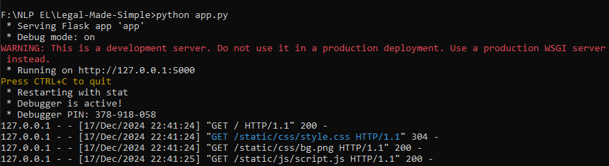

# Legal Made Simple
<div style="text-align: justify;">
The legal system relies heavily on precedents, where past court decisions serve as benchmarks for resolving current cases. In this context, identifying similar cases and uncovering subtle relationships is crucial for understanding legal complexities and extracting relevant information. However, legal professionals often face challenges in navigating vast repositories of cases, as intricate patterns and connections are not always immediately evident. This application leverages Named Entity Recognition (NER) to extract key legal entities and employs SQL to efficiently retrieve relevant cases from extensive legal databases.
</div>

## Steps to Reproduce the Project
### 1. Clone this project
``` git clone https://github.com/Skanda-P-R/Legal-Made-Simple.git ```
### 2. Install the Huggingface NER model
The NER model is trained on	17485 annotated Case statements, and the model can extract 14 types of Named Entities. They are:<br>
<center>

| Named Entity             |    Extract From    | Description                                                                                                                                               |
|:---------------:|:------------------:|-----------------------------------------------------------------------------------------------------------------------------------------------------------|
| COURT          | Preamble, Judgment | Name of the court which has delivered the current judgement if extracted from Preamble. Name of any court mentioned if extracted from judgment sentences. |
| PETITIONER  | Preamble, Judgment | Name of the petitioners / appellants /revisionist  from current case                                                                                      |
| RESPONDENT | Preamble, Judgment | Name of the respondents / defendents /opposition from current case                                                                                        |
| JUDGE |      Premable, Judgment      | Name of the judges from current case  if extracted from preamble. Name of the judges of the current as well as previous cases if extracted from judgment sentences.       |                                                                                        |
| LAWYER |      Preamble      | Name of the lawyers from both the parties                                                                                                                 |
| DATE |      Judgment      | Any date mentioned in the judgment                                                                                                                        |
| ORG |      Judgment      | Name of organizations mentioned in text apart from court. E.g. Banks, PSU, private companies, police stations, state govt etc.                            |
| GPE |      Judgment      | Geopolitical locations which include names of countries,states,cities, districts and villages                                                             | 
| STATUTE |      Judgment      | Name of the act or law mentioned in the judgement                                                                                                         |
| PROVISION |      Judgment      | Sections, sub-sections, articles, orders, rules under a statute                                                                                           |
| PRECEDENT |      Judgment      | All the past court cases referred in the judgement as precedent. Precedent consists of party names + citation(optional) or case number (optional)         |
| CASE\_NUMBER |      Judgment      | All the other case numbers mentioned in the judgment (apart from precedent) where party names and citation is not provided                                |
| WITNESS    |      Judgment      | Name of witnesses in current judgment                                                                                                                     |
| OTHER_PERSON    |      Judgment      | Name of the all the person that are not included in petitioner,respondent,judge and witness                                                               |     

</center>

To install the model, run this command:<br> ```pip install https://huggingface.co/opennyaiorg/en_legal_ner_trf/resolve/main/en_legal_ner_trf-any-py3-none-any.whl```

### 3. Install the python libraries
Create a virtual environment, or you can directly install the python libraries globally. Run this to install the dependencies:<br> ``` pip install -r requirements.txt ```
### 4. Run the Flask Backend
Run this command to start the flask backend on 127.0.0.1:5000.<br>```python app.py```<br><br>The command promt screen will show something like this:<br><br>

### 5. Open the Webpage
Open your prefered browser and go to the link where the Flask Backend is running. By default, it will be "http://127.0.0.1:5000/". If you have done correctly, you should see the webpage like this:<br><br>

<br><br>Now, you can enter anything related to legal in the **Sample Case Textbox** and the **Named Entities** extracted from the statement is shown below, along with the **Relevant Case Statements** which matches with the sample text provided.<br>
A Llama model is trained on these extracted case statements, and the user can ask any prompt he likes, and the model will generate relevant answers.<br><br><br>
An example is shown in the below image:<br><br>


## Acknowledgments
* [HPCC Systems](https://hpccsystems.com/) for scalable data processing solutions.
* Hugging Face for providing the NER model infrastructure.
* OpenNYAI for creating the ```en_legal_ner_trf``` legal [NER model](https://huggingface.co/opennyaiorg/en_legal_ner_trf).
* [Groq Cloud](https://groq.com/) for the Llama model.

### NOTE: If you want to learn how the Application works, please read the [AppWorking.md](https://github.com/Skanda-P-R/Legal-Made-Simple/blob/main/AppWorking.md) file. If you want to read how the case statements are fetched from HPCC System, please visit [this](https://github.com/Skanda-P-R/Searching-Techniques-used-in-HPCC) repository. The old version of using HPCC is in the [hpcc branch](https://github.com/Skanda-P-R/Legal-Made-Simple/tree/hpcc). The [main branch](https://github.com/Skanda-P-R/Legal-Made-Simple/tree/main) uses a SQL server to fetch the relavent case statements. 
